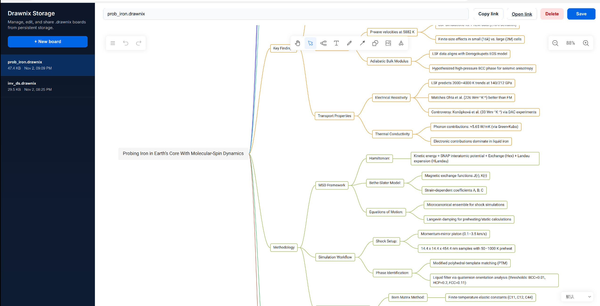
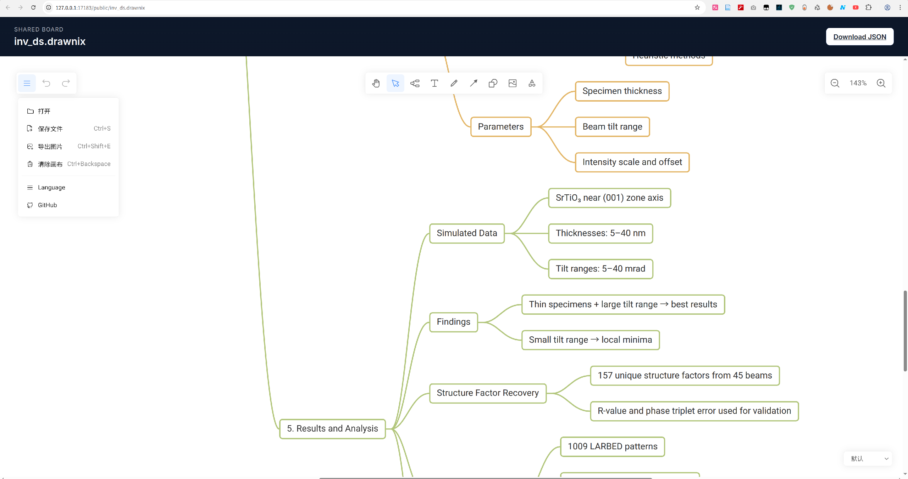

# Drawnix

## Features

- Mind Maps and Flowcharts self-hosted
- Persistent storage backed by a shared `/storage` volume
- Web UI to create, browse, edit, and share `.drawnix` files
- Edit Features: Undo, Redo, Copy, Paste, etc.
- Support opening Markdown (.md) and Mermaid (.mmd) files directly from `Menu → Open`
- Export to PNG, JPG, JSON(.drawnix)

## Docker Deployment
Build the storage-enabled image:

```
docker build -f ./Dockerfile -t drawnix-storage .
```

Run it with a host storage mount (exposes port `3000` inside the container):

```
docker run -p 17183:3000 -v "$(pwd)/data/storage:/storage" drawnix-storage
```

The Web UI and API will then be reachable at <http://localhost:17183>. The
container reads and writes `.drawnix` files inside `/storage`.

### Opening files

- Drawnix JSON (`.drawnix`, `.json`) loads the saved board state.
- Markdown documents (`.md`, `.markdown`, `.mdown`, `.mkd`, `.mdtxt`) are converted on import using the built-in Markdown-to-Drawnix parser.
- Mermaid diagrams (`.mmd`, `.mermaid`, `.mm`) are rendered automatically during import.

Or spin it up with Docker Compose (uses the same volume mapping):

```
docker-compose up -d
```

## Screenshots

### Create/Open/View a mindmap



### Render a mindmap in a shared link




## Project Background

1. I want to host my mindmaps myself, but [drawnix](https://github.com/plait-board/drawnix) lacks storage function.
2. I implemented the persistent storage backed by a shared `/storage` volume in the docker container.
3. I do not care security as I only deploy in my home network.


## Storage API

The container exposes a simple JSON API for managing `.drawnix` files in
`/storage`:

- `GET /api/files` – list stored files with size, modified timestamp, and public URL.
- `POST /api/files` – create a new file (`{ name, content }`). Rejects duplicates.
- `GET /api/files/{name}` – download a file's JSON content.
- `PUT /api/files/{name}` – update content and optionally rename (`{ name?, content }`).
- `DELETE /api/files/{name}` – remove a file.
- `GET /public/{name}` – public, read-only link that streams the raw `.drawnix` file.

All filenames are normalised to retain the `.drawnix` extension. Keep payload
sizes reasonable when uploading large boards.

## Dependencies

- [plait](https://github.com/worktile/plait) - Open source drawing framework
- [slate](https://github.com/ianstormtaylor/slate) - Rich text editor framework
- [floating-ui](https://github.com/floating-ui/floating-ui) - An awesome library for creating floating UI elements


## License

GPL
